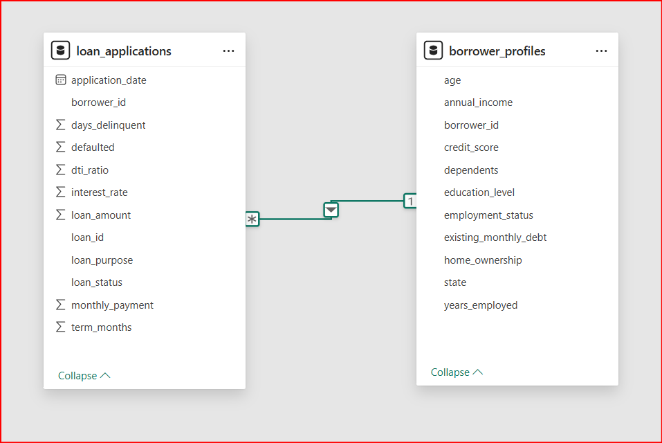
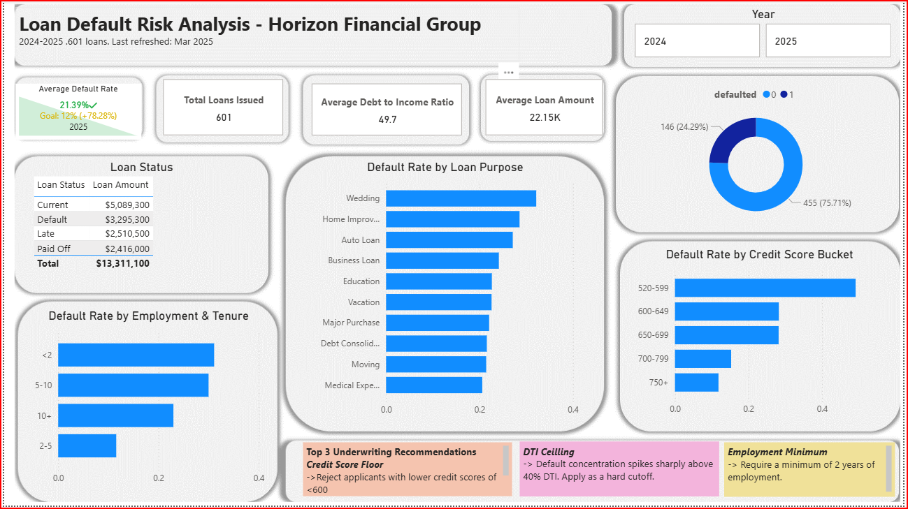
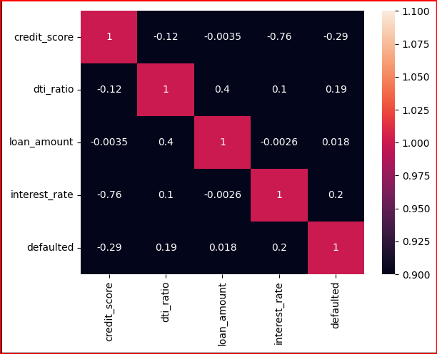

# Loan Default Risk Analysis - Horizon Financial Group

## 1. Background & Business Problem
Horizon Financial Group has issued over 600 personal loans across 2024-2025. However, the company is experiencing a default rate of ~24%, which is significantly higher than the target of 12%.

The project was conducted to:
1. Identify key drivers of loan defaults
2. Provide data-driven underwriting recommendations
3. Support risk reduction and improve loan portfolio performance

## 2. Data Overview
Two datasets were used:
1. Loan Profiles: Demographics, income, credit score, employment
2. Loan Applications: Loan amount, purpose, DTI ratio, repayment status

After cleaning and merging:
* 500 borrower records
* 602 loan records
* No missing or duplicate values detected.

The data was stored in an SQL server and was pulled to a python file for analysis. Data cleaning and analysis file can be found [here](loan_analysis.ipynb).

## 3. Executive Summary (Key Insights)
* Default rate is 24.3%, double the acceptable threshold.
* Credit score is the strongest predictor of default.
* DTI ratio above ~40% sharply increases risk.
* Borrowers with < 2 years employments are high risk (~31%).
* Loan purpose matters: wedding and discretionary loans default more. 

Review the PowerBI dashboard below:

## 4. Insights Deep Dive
### 4.1 Credit Score Analysis
* 520-599 -> ~49% default rate(higher risk)
* 750+ -> ~12% default rate (lowest risk)

*Insight:* There is a clear inverse relationship. Lower credit score = higher probability of default.

### 4.2 Debt-to-Income (DTI) Ratio
* <40% -> Relatively safe (~12-15%)
* 40-60% -> Risk increases (~28%)
* 60% -> High risk (35+)

*Insight:* Default risk rises significantly beyond ~40% DTI

### 4.3 Loan Purpose Risk
Highest default rates were:
* Wedding (~32%)
* Home Improvement (~29%)
* Auto Loans (~27%)
Lowest default rates were:
* Medical (~20%)
* Debt Consolidation (~21%)

*Insight*: Discretionary spending loans carry higher risk.

### 4.4 Loan Amount Impact
* Defaulted average: ~$22,570
* Non-defaulted average: ~$22, 013

*Insight* Loan size has minimal impact on default risk.

### 4.5 Employment & Tenure
* <2 years -> ~31% default (highest risk)
* 2-5 years -> ~11% (lowest risk)

*Insight*: Employment stability is a strong behavioral risk indicator.

### 4.6 Correlation Analysis

Strongest relationships with default are credit score (-0.29), interest rate (0.20) and DTI ratio (0.19).

*Insight*: Financial stress + poor credit = higher defaults.

## 5. Key Risk Drivers
Based on the analysis, the top 3 predictors of default are:
1. Low credit score
2. Higher DTI ratio and
3. Short employment history.

## 6. Business Recommendations
**1. Credit Score Cutoff:** Reject applicants with a credit score less than 600. This Reduces exposure to highest-risk group with a ~49% default rate.

**2. DTI Threshold:** Set a maximum DTI at 40% to prevent sharp increase in default probability.

**3. Employment Requirement:** Minimum 2 years employment requirement to target more financially stable borrowers.

**4. Risk-Based Loan Approval:** Apply stricter rules for wedding loans and home improvement loans.

If the above changes are implemented, the company will reduce its default rate to bring it closer to 12% as well as improve portfolio quality and increase long-term profitability.

This analysis shows that **who you lend matters more than how much you lend.**

Focusing on creditworthiness, debt burden and income stability will significantly reduce default risk and improve lending decisions.

